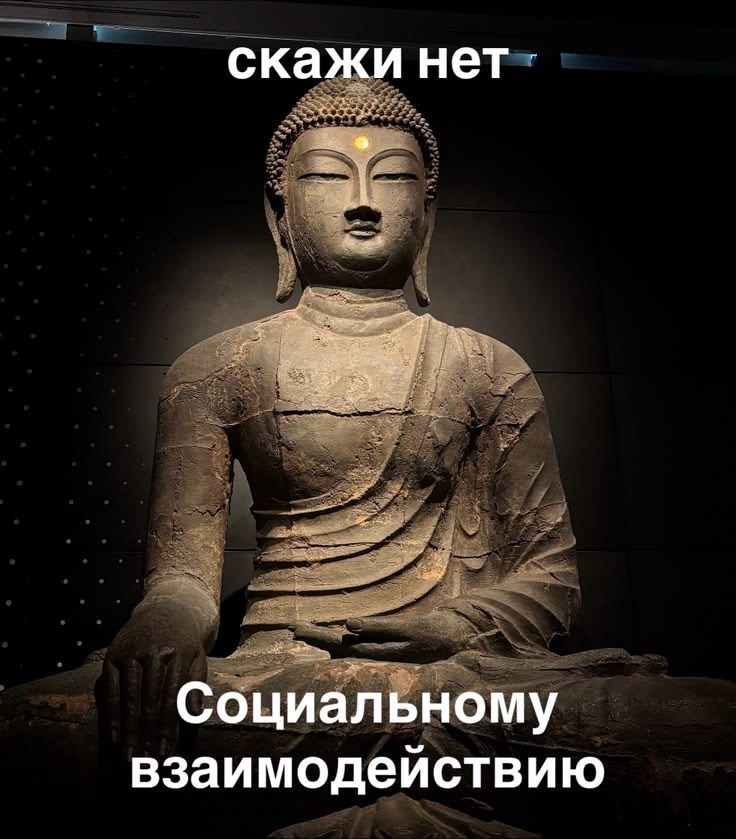

markdown
# Лабораторная работа №1

## Информация о студенте

- **ФИО:** Штирбу Н.И.
- **Группа:** 6404-010302D
- **Научный руководитель:** Ростова Е.П.
- **Предполагаемая тема диплома:** Оптимизация деятельности прелприятия с учетом производственных функций 

## Любимая цитата

«В каждом человеке есть солнце. Только дайте ему светить.»
